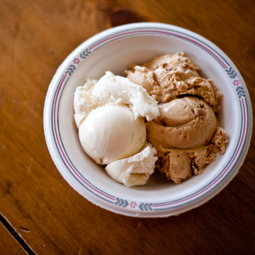

# Image Classification for Food And Skin Disease Dataset

This repository contains the second midterm project for the "Principles of Artificial Intelligence" course offered by the Department of Automation at Tsinghua University. This project focuses on the classification of food dataset or skin disease dataset. 

## Models

Six models are realized in the directory `models`, including:

- **AlexNet** without batch normalization and dropout: `AlexNet` in `alexnet.py`.
- **AlexNet** with batch normalization and dropout: `AlexNetPro` in `alexnet.py`.
- **VGG11** without batch normalization and dropout: `VGG11` in `vgg11.py`.
- **VGG11** with batch normalization and dropout: `VGG11Pro` in `vgg11.py`.
- **ResNet** without batch normalization: `ResNet` in `ResNet.py`.
- **ResNet** with batch normalization: `ResNetPro` in `ResNet.py`.

The structure of the networks are shown below:


## Training

We train each model with batch size 64, learning rate 0.01, and number of epochs 30. The results are shown in the following table.

| Model      | Training loss | Test accuracy |
| ---------- | ------------- | ------------- |
| AlexNet    |  |  |
| AlexNetPro |  |  |
| VGG11      |  |  |
| VGG11Pro   |  |  |
| ResNet     |  |  |
| ResNetPro  |  |  |

One can train the model using the following command:

```bash
python train.py \
    --model_name alexnet \
    --dataset food \
    --learning_rate 0.01 \
    --batch_size 64 \
    --num_epochs 30
```

## Evaluation

One can evaluate the model on the dataset using the following command:

```bash
python eval.py \
    --dataset food \
    --model_path checkpoints/alexnet_food
```

## CLI

We provide cli for user to classify any figure using the trained model:

```bash
python cli.py --model_path checkpoints/alexnetpro_food/
```

Then user can input the path to the desire figure to get the classification. We use the trained AlexNetPro model as an example:


## Visualization 

We use Grad-CAM to visualize the decision process of the networks, using [pytorch-grad-cam](https://github.com/jacobgil/pytorch-grad-cam.git). To install:

```bash
pip install grad-cam
```

To generate the Grad-CAM figure:

```bash
python cam.py --image_path data/Food-101-archive/apple_pie/68383.jpg --model_path checkpoints/alexnetpro_food/ --target_class 0
```

The class number corresponding to the classes is in `utils.constants.py`.

The Grad-CAM figures generated by each model is shown below (as an example):

| Original Figure | AlexNetPro | VGG11Pro | ResNetPro |
| --------------- | ---------- | -------- | --------- |
|  |  |  |  |
|  |  |  |  |
|  |  |  |  |
|  |  |  |  |
|  |  |  |  |
|  |  |  |  |
